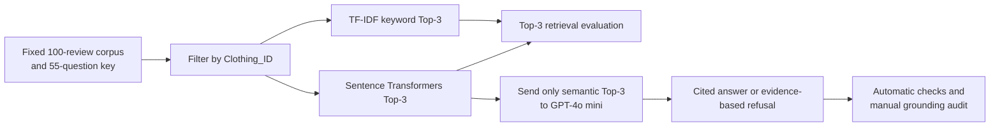
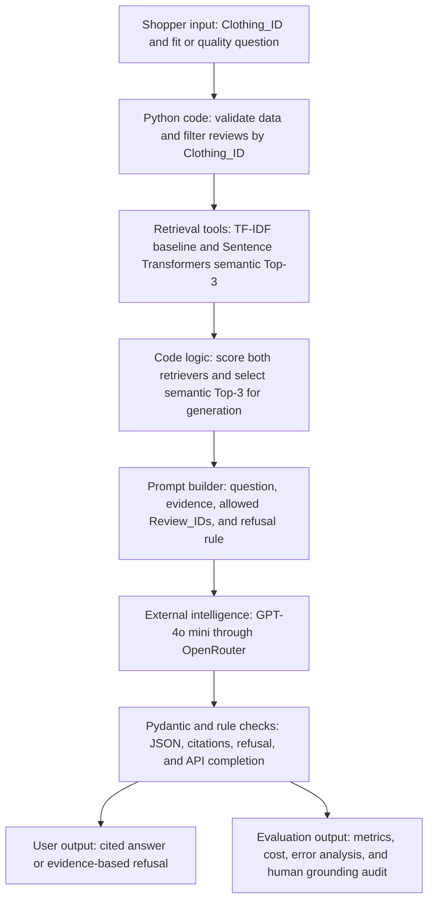

# Clothing Review RAG

PE6201 Individual Project — Xiaonan Zhao

This repository contains a small, reproducible Retrieval-Augmented Generation (RAG) prototype for answering **fit** and **quality** questions about clothing. For each question, the system searches a fixed corpus of 100 reviews for the same `Clothing_ID`, returns the Top-3 reviews, and asks GPT-4o mini to produce either:

- a short answer supported by cited `Review_IDs`; or
- `I don't know. The available reviews do not provide enough evidence.`

The project compares a **TF-IDF keyword baseline** with a **Sentence Transformers semantic retriever** on the same fixed questions. It does not predict returns, recommend whether to buy, search the web, or use information outside the retrieved reviews.

## Repository files

| File | Purpose |
|---|---|
| [`Prerun_Clothing_RAG.ipynb`](./Prerun_Clothing_RAG.ipynb) | Main Google Colab notebook. It contains saved outputs for inspection and can also be rerun from the beginning. |
| [`Clothing_RAG_Test_Key_55_Paraphrase.xlsx`](./Clothing_RAG_Test_Key_55_Paraphrase.xlsx) | **Required notebook input. Upload this file when prompted.** It contains the fixed 55-question key, gold evidence, and an embedded copy of the 100-review corpus. |
| [`Clothing_Review_Preprocessed_100.xlsx`](./Clothing_Review_Preprocessed_100.xlsx) | Data-provenance explainer: the 1,000-row source sample, preprocessing method, product split, and final 100-review corpus. |
| [`Clothing_RAG_Complete_Results__55q.xlsx`](./Clothing_RAG_Complete_Results__55q.xlsx) | Machine-generated reference results before human grounding review. Its manual-audit columns are intentionally blank. |
| [`Clothing_RAG_Complete_Results_55q_Manual Audited.xlsx`](./Clothing_RAG_Complete_Results_55q_Manual%20Audited.xlsx) | Final reference results after all 55 answers were manually audited for unsupported facts. |
| [`Github + Youtube Video Presentation Link.docx`](./Github%20%2B%20Youtube%20Video%20Presentation%20Link.docx) | Supplementary submission links for the repository and recorded presentation. |

The four Excel workbooks are explained in more detail in [Explainer files](#explainer-files).

## Fastest way to run the project in Google Colab

### Run instructions

1. Click the **Open in Google Colab** badge above. If necessary, sign in to Google and choose **Open notebook**.
2. In Colab, select **Runtime → Run all**. Run the cells in order; do not begin from a later stage.
3. When the upload box appears, upload exactly:
   `Clothing_RAG_Test_Key_55_Paraphrase.xlsx`
4. Wait while the notebook validates the workbook, builds both retrieval systems, and evaluates Top-3 retrieval.
5. When prompted, paste an **OpenRouter** API key into the hidden input box and press Enter. Do not paste the key into a code cell.
6. Wait for the generation counter to finish from `[01/55]` to `[55/55]`.
7. After the final checks, Colab automatically downloads:
   `Clothing_RAG_Complete_Results_OpenRouter_55q.xlsx`

The required input workbook already contains the `Corpus_100` sheet. **Do not upload `Clothing_Review_Preprocessed_100.xlsx` when the notebook asks for the experiment input.**

The included notebook is “pre-run,” meaning its reference outputs remain visible without spending API credit. A fully fresh run still requires the input workbook and an OpenRouter key.

## What the notebook does

The stages are:

1. **Load and validate data.** Confirm 100 unique reviews, 55 fixed questions, valid `Clothing_IDs`, unique `Review_IDs`, and valid gold-evidence labels.
2. **Semantic retrieval.** Encode questions and reviews with `sentence-transformers/multi-qa-MiniLM-L6-cos-v1`, calculate cosine similarity, and return the Top-3 reviews for the same product.
3. **Keyword baseline.** Apply TF-IDF retrieval to the same questions and same product-filtered review pool, also returning Top-3.
4. **Retrieval evaluation.** Compare both methods with Hit@3 and Recall@3 on the 47 answerable questions.
5. **Grounded generation.** Send only the question and the semantic Top-3 reviews to `openai/gpt-4o-mini` through OpenRouter. The model does not receive the gold answer or external knowledge.
6. **Automatic checks.** Validate API completion, answer format, refusal format, and whether every cited ID belongs to the supplied Top-3.
7. **Export.** Create the result workbook, evidence table, error analyses, cost fields, and a blank worksheet for human grounding review.

## Evaluation design

The question set has two intentionally separate parts:

| Question IDs | Role | Composition |
|---|---|---|
| Q01–Q30 | Primary fixed test | 15 answerable fit questions, 10 answerable quality questions, and 5 intentionally unanswerable negative controls |
| Q31–Q55 | Supplementary paraphrase stress test | 25 low-keyword-overlap paraphrases: 22 answerable and 3 intentionally unanswerable |

The original 30 questions remain the primary evaluation. Their wording often overlaps directly with the reviews, so TF-IDF achieved higher original-set Recall@3 even though the two methods tied on original-set Hit@3. The extra 25 questions were then added as a separate stress test of the hypothesis that semantic retrieval should be more robust when a question and its relevant review express the same idea with different words. The original questions and labels were not replaced or rewritten after seeing the results, and both retrieval methods ran on the same questions.

Overall, 47 questions are answerable and 8 are intentionally unanswerable. The unanswerable questions test whether the system refuses instead of inventing an answer. All `Gold_Review_IDs`, supported facts, and expected actions were fixed before the corresponding evaluation run.

To reduce leakage, the 100 reviews were split by whole `Clothing_ID`: 3 products for development and 7 products for final evaluation. A product does not appear in both groups.

### Metrics

- **Hit@3:** whether at least one gold review appears in the retrieved Top-3.
- **Recall@3:** the number of retrieved gold reviews divided by all gold reviews for that question.
- **Abstention behavior:** correct refusal on unanswerable questions and false refusal on answerable questions.
- **No unsupported facts:** a human checks whether every factual statement in the generated answer is supported by the three reviews supplied to GPT.

Grounding is not the same as retrieval correctness. For example, a refusal can contain no invented fact but still be a false refusal if the retriever missed a relevant gold review. Retrieval, refusal, and grounding are therefore reported separately.

## Reference-run results

These values are included only as a reproducibility check. A future run can produce different answer wording, token counts, and costs because it uses an external model provider.

| Retrieval metric on 47 answerable questions | TF-IDF keyword | Sentence Transformers |
|---|---:|---:|
| Overall Hit@3 | 61.7% | **70.2%** |
| Mean Recall@3 | 56.0% | **56.7%** |
| Paraphrase Hit@3 (22 answerable questions) | 31.8% | **50.0%** |

| Generation and audit check | Reference result |
|---|---:|
| API calls completed | 55 / 55 |
| Mechanical checks passed | 55 / 55 |
| Correct refusals on unanswerable questions | 8 / 8 |
| False refusals on answerable questions | 2 / 47 |
| Manual no-unsupported-facts judgments | 44 / 55 (80.0%) |

## Result workbook guide

A fresh run produces `Clothing_RAG_Complete_Results_OpenRouter_55q.xlsx`. The included automatic reference copy was retained under the shorter filename `Clothing_RAG_Complete_Results__55q.xlsx`; the content structure is the same.

| Worksheet | Contents |
|---|---|
| `Retrieval_Summary` | Aggregate Hit@3 and mean Recall@3 for TF-IDF and semantic retrieval, overall and by test group. |
| `Retrieval_Results` | Question-level keyword and semantic Top-3 IDs, scores, gold matches, Hit@3, and Recall@3. |
| `GPT_Answers` | Final answer, cited IDs, refusal flag, token counts, estimated cost, errors, and automatic checks. |
| `Evidence_165` | The exact 3 semantic reviews supplied to GPT for each of 55 questions (55 × 3 = 165 rows). |
| `Grounding_Audit` | Final answers and evidence, plus blank fields for human judgment and notes. |
| `Fixed_Test_Key_30` | A copy of the complete fixed test key. The sheet keeps a legacy name but contains all 55 questions. |
| `Changed_Questions` | Questions for which semantic and keyword Hit@3 differ. |
| `Semantic_Misses` | Answerable questions where semantic Top-3 contains none of the gold IDs. |
| `Unanswerable` | The 8 negative-control questions and their system behavior. |
| `ReadMe` | Short instructions embedded inside the workbook. |

Two labels inside the Excel files are retained from earlier versions: `Test_Key_30`/`Fixed_Test_Key_30` now contain 55 questions, and an embedded note that says `Evidence_90` should be read as the actual worksheet `Evidence_165`.

## How to perform the manual grounding audit

The notebook can verify citation IDs mechanically, but it cannot reliably decide whether every natural-language claim is supported. That is why the final step is manual.

1. Open the `Grounding_Audit` worksheet in the automatic result workbook.
2. For each question, compare `Final_Answer` with `Top_3_Evidence` and the cited Review IDs.
3. Enter **Yes** in `Manual_No_Unsupported_Facts` only when every factual claim is supported by the supplied reviews.
4. Enter **No** if any claim, inference, recommendation, or generalisation goes beyond the evidence.
5. In `Manual_Notes`, identify the supported evidence or explain the exact unsupported claim.

The completed example is provided in `Clothing_RAG_Complete_Results_55q_Manual Audited.xlsx`: all 55 rows have a judgment and note, with 44 `Yes` and 11 `No` judgments.

## Explainer files

### 1. `Clothing_RAG_Test_Key_55_Paraphrase.xlsx`

This is the **only Excel input required by the notebook**.

- `Test_Key_30`: all 55 fixed questions, answerability labels, gold Review IDs, supported facts, gold answers, and expected actions.
- `Evidence_Audit`: the exact review text used to verify the original gold-evidence annotations.
- `Corpus_100`: the portable 100-review corpus used by both retrievers.
- `ReadMe`: workbook-level notes. Some counts in this sheet describe an earlier 30/38-question version; the table itself contains the authoritative Q01–Q55 set.

The gold columns are used for scoring only. They are not passed to GPT as an answer source.

### 2. `Clothing_Review_Preprocessed_100.xlsx`

This workbook documents where the final corpus came from and makes the preprocessing auditable.

- `Raw_1000`: the 1,000 source rows supplied for the project; 958 contain review text and 42 are blank.
- `Method`: the deterministic cleaning and sampling protocol, including seed `6201`, the selected products, and the development/final-evaluation split.
- `Corpus_100`: 100 cleaned reviews from 10 products, with 10 reviews per product and stable `R001`–`R100` citation IDs.

It is an explainer/provenance file, not the runtime upload, because its final `Corpus_100` sheet is already copied into the test-key workbook.

### 3. `Clothing_RAG_Complete_Results__55q.xlsx`

This is the automatic reference output from the completed notebook. It contains retrieval comparisons, GPT answers, exact Top-3 evidence, token/cost estimates, error analyses, and the blank manual-audit template. The two manual columns are empty by design.

### 4. `Clothing_RAG_Complete_Results_55q_Manual Audited.xlsx`

This is the post-run human-audited version of the same experiment. Its `Grounding_Audit` sheet has a `Yes`/`No` judgment and written rationale for every one of the 55 questions. It is the evidence for the reported no-unsupported-facts result; it is not used as an input to the model.

## Scope and limitations

This is a course prototype over a fixed 100-review corpus. It answers only evidence-supported fit and quality questions for the selected products. It should not be used to predict returns, make autonomous purchase decisions, provide universal sizing advice, or infer facts not stated in the reviews.

## Product documentation

### Persona

**Primary user:** an online clothing shopper viewing a specific product who wants a fast, traceable answer about fit or garment quality without reading every review. The shopper needs a concise evidence summary and must be told when the selected product's reviews do not contain enough evidence. This prototype is decision support only: it does not predict returns or make a buy/no-buy recommendation.

### Inputs

| Input | Role in the product |
|---|---|
| `Clothing_ID` | Selects the product and prevents evidence from other products entering the answer. |
| Natural-language question | A fit or quality question, such as whether an item runs small or whether its material feels durable. |
| Review corpus | 100 cleaned reviews from 10 products, with stable `Review_IDs`; only reviews matching the requested `Clothing_ID` are eligible. |
| Evaluation key | 55 fixed questions with answerability labels and gold evidence. It is used for scoring only; gold answers and labels are not sent to GPT. |

### Outputs

- **User-facing output:** a concise, evidence-supported answer with `Review_ID` citations drawn only from the retrieved Top-3 reviews.
- **Safe fallback:** the exact refusal `I don't know. The available reviews do not provide enough evidence.` when the retrieved evidence is insufficient.
- **Evaluation output:** an Excel workbook containing both retrievers' Top-3 results, GPT answers, citations, token and cost fields, error tables, and the manual grounding-audit sheet.

### High-level product architecture

The reproducible code path uses pandas/openpyxl for data and export, scikit-learn for TF-IDF, `sentence-transformers/multi-qa-MiniLM-L6-cos-v1` for semantic retrieval, and Pydantic plus deterministic checks for output validation. GPT-4o mini is the only external intelligence component. It receives only the question and semantic Top-3 reviews; it does not receive the gold answer, access the web, or see reviews from another product. TF-IDF is an evaluation baseline rather than a second source for the generated answer.

### Metrics targeted and metrics reached

The targets below are prototype acceptance criteria and decision rules. The reached values come from the included 55-question reference run (47 answerable questions and 8 intentionally unanswerable controls).

| Metric | Target / decision rule | Reached in the reference run | Assessment |
|---|---|---|---|
| Overall semantic Hit@3 | Exceed TF-IDF on the same 47 answerable questions | **70.2%** vs TF-IDF **61.7%** (+8.5 percentage points) | Met |
| Paraphrase semantic Hit@3 | Exceed TF-IDF on the 22 answerable low-keyword-overlap questions | **50.0%** vs TF-IDF **31.8%** (+18.2 points) | Met |
| Semantic mean Recall@3 | At least match TF-IDF overall | **56.7%** vs TF-IDF **56.0%** (+0.7 points) | Marginally met |
| API completion and mechanical validity | 100% of 55 questions complete; 100% pass format, refusal, and citation-ID checks | **55/55** API calls completed and **55/55** mechanical checks passed | Met |
| Correct refusal on unanswerable questions | 100% | **8/8 (100%)** | Met |
| False refusal on answerable questions | 0% | **2/47 (4.3%)** | Not met |
| No unsupported facts | 100% of outputs grounded in the supplied Top-3 evidence | **44/55 (80.0%)** overall; **34/45 (75.6%)** among generated answers | Not met |
| LLM cost observability | Record tokens and estimated cost for every completed call; monitoring metric, not a pass threshold | **US$0.0068637** total, about **US$0.0001248 per question** | Measured |

**Interpretation and critique.** The semantic retriever achieved the main robustness goal on overall and paraphrase Hit@3, but its overall Recall@3 advantage was only 0.7 points. On the original 25 answerable questions, semantic Recall@3 was lower than TF-IDF (62.7% vs 77.3%), so the result supports semantic retrieval mainly under paraphrase rather than as a universal replacement for keyword search. Operational reliability was strong, but 55/55 valid API responses did not guarantee factual quality: the 80.0% grounding result missed the 100% safety target. The system is therefore a reproducible course prototype, not a production-ready shopping assistant.
